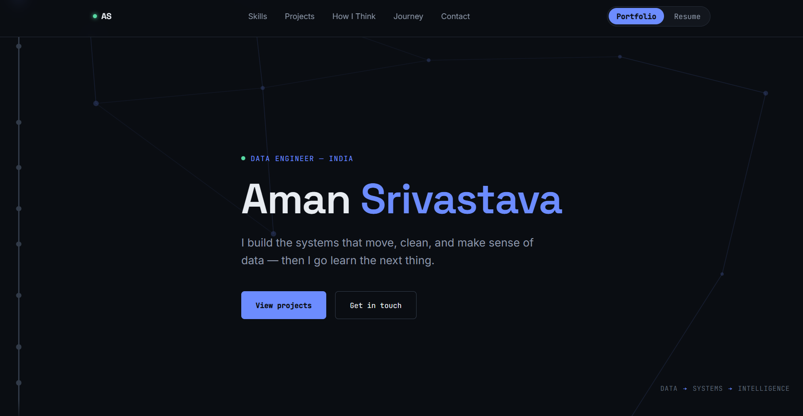
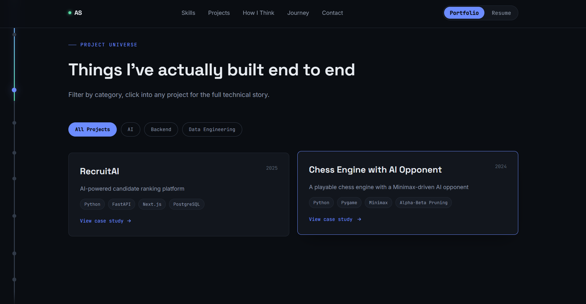
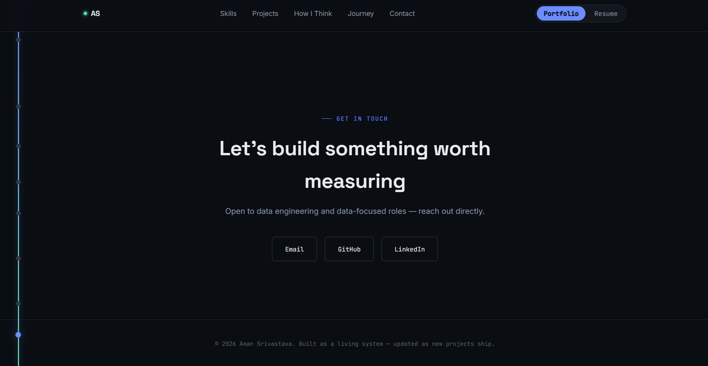

# Aman Srivastava — Data Engineer Portfolio

> A personal portfolio showcasing my Data Engineering journey, technical skills, projects, and engineering approach.

## 🌐 Live Portfolio

**[View Portfolio](https://aman-3003.github.io/aman-portfolio/)**

---

## 📸 Portfolio Preview

### Hero

### Skill Architecture

### Projects

### Contact

---

## 🚀 About

I'm a Computer Science undergraduate focused on Data Engineering, with a strong foundation in Python, SQL, databases, and backend development.

I'm currently deepening my knowledge of:

- Apache Kafka
- Apache Spark
- Apache Airflow
- ETL / ELT
- Data Warehousing
- Cloud
- Docker

---

## 🛠️ Tech Stack

### Foundations
- Python
- SQL
- OOP
- DBMS
- Data Structures & Algorithms

### Databases
- MySQL
- PostgreSQL

### Data & Analysis
- Pandas
- NumPy
- Matplotlib
- Seaborn

### AI & Backend
- NLP
- Sentence Transformers
- FastAPI

### Data Engineering
- ETL / ELT
- Apache Kafka
- Apache Spark
- Airflow
- Data Warehousing
- Cloud
- Docker

### Tools
- Git / GitHub

---

## 📂 Featured Projects

### RecruitAI

An AI-powered candidate ranking platform that parses resumes, extracts structured skill data, and semantically ranks candidates against job descriptions.

**Technologies:** Python, FastAPI, Next.js, PostgreSQL, SQLAlchemy, NLP, Sentence Transformers

### Chess Engine with AI Opponent

A playable chess engine with full rule validation and a Minimax-driven AI opponent using Alpha-Beta pruning.

**Technologies:** Python, Pygame, Minimax, Alpha-Beta Pruning, OOP

---

## 🎓 Education

**SRM Institute of Science and Technology**  
B.Tech, Computer Science and Engineering  
Chennai, Tamil Nadu  
Aug 2023 – May 2027

**CGPA:** 8.83

---

## 📜 Certifications

- Complete Python Programming: From Basics to Advance — Udemy
- Smart India Hackathon — Participation

---

## 🧠 Engineering Approach

My workflow:

**Understand → Design → Choose Tools → Build → Test → Optimize → Learn**

I focus on understanding the real problem first, designing the data flow and architecture, building an end-to-end solution, testing against realistic data, and learning the technologies needed to solve the problem properly.

---

## 🔨 Currently Building

**Deepening Data Engineering Fundamentals**

Working through Kafka, Spark, and Airflow to move from data analysis into real pipeline engineering.

**Next milestone:** Ship a small end-to-end pipeline project using at least one of these technologies.

---

## 📬 Connect With Me

- **Email:** as0448380@gmail.com
- **GitHub:** [Aman-3003](https://github.com/Aman-3003)
- **LinkedIn:** [sriam3003](https://www.linkedin.com/in/sriam3003)

---

## 📄 License

This portfolio is personal work by Aman Srivastava.
